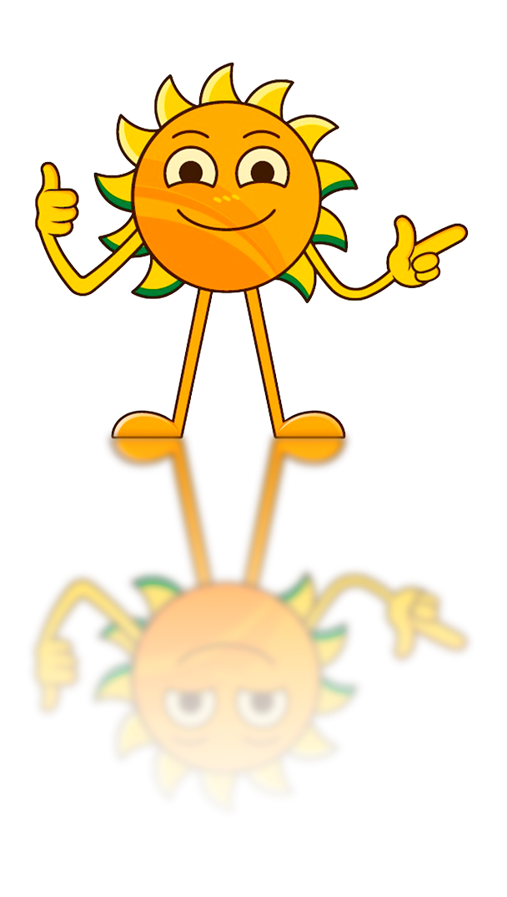

  

<h2 align="center">
  Cooperativa Agrícola Ganadera Ltda.   “Guillermo Lehmann”
</h2>

    </a>

<h4 align="center" 
  <em>“¡Hola! Soy Guille 🤖☀️… el chatbot de LA LEHMANN.”</em>
</h4>

<h4 align="center">
  
</h4>

## 🛠️ Stack (referencial)

  
  
  
  
  
  
  

---

  Este README vive en <code>.github/profile/README.md</code> y define el perfil de la organización.

